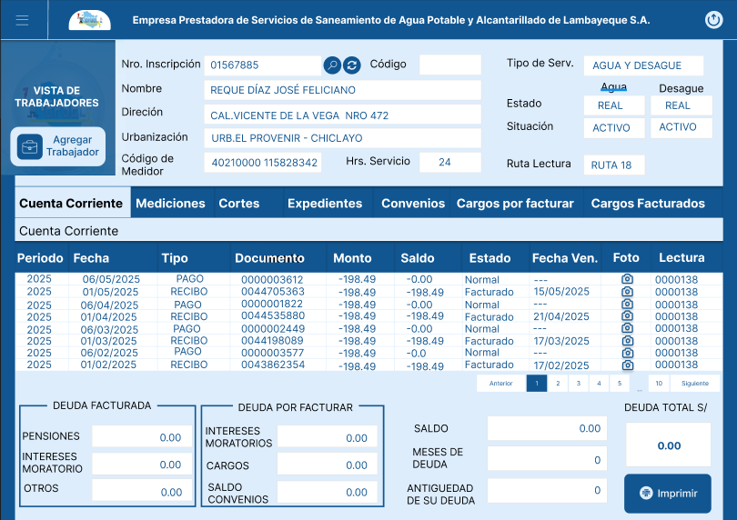
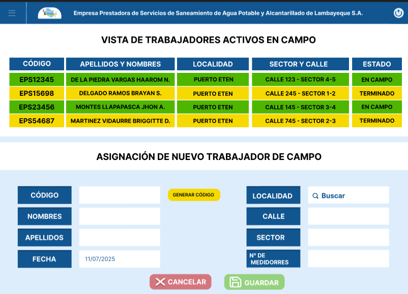
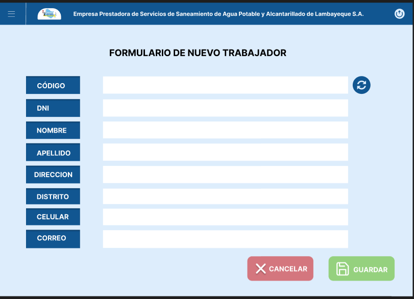
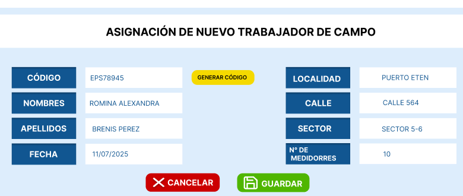
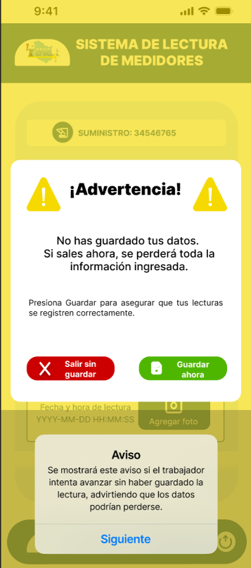
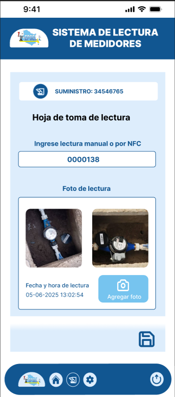
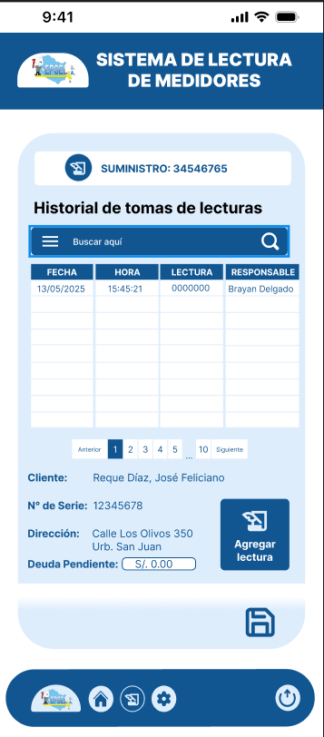
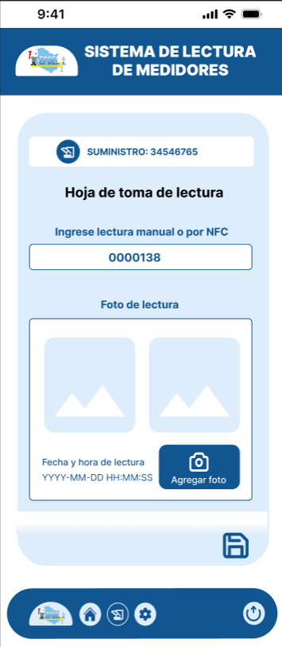

# EPSEL Smart Reader

## Descripción del Proyecto

EPSEL Smart Reader es una solución móvil desarrollada para la Empresa Prestadora de Servicios de Saneamiento de Lambayeque S.A. (EPSEL), cuyo propósito es optimizar el proceso de lectura de medidores de agua mediante el uso de Inteligencia Artificial (IA), Reconocimiento Óptico de Caracteres (OCR) y servicios de almacenamiento en la nube.

La aplicación permite capturar imágenes de los medidores utilizando dispositivos móviles, procesarlas automáticamente para extraer la lectura, validar la información comparándola con el historial de consumo y almacenar los datos de forma segura, reduciendo errores de facturación y mejorando la eficiencia operativa.

---

# Objetivo

Desarrollar una una solución tecnológica que permita automatizar el proceso de lectura de medidores de agua, mejorando la precisión de las lecturas, reduciendo los errores humanos y optimizando la gestión de la información en EPSEL.

---

# Tecnologías Utilizadas

## Frontend
- Flutter
- Dart

## Backend
- Java
- Spring Boot (Este backend se conectará con Firebase Firestore)

## Base de Datos
- Firebase Firestore

## Inteligencia Artificial
- OCR (Reconocimiento Óptico de Caracteres) - Implementado con `google_mlkit_text_recognition`

## Cloud Computing
- Google Cloud Storage (para almacenamiento de imágenes)
- Firebase (para base de datos Firestore y otros servicios de backend)

## Control de Versiones
- Git
- GitHub

---

# Requisitos

Antes de ejecutar el proyecto es necesario contar con:

- Java JDK 21 o superior (para el backend Spring Boot)
- Flutter SDK
- Android Studio
- Acceso a una cuenta de Firebase y un proyecto configurado
- Git
- Visual Studio Code

---

# Instalación

## 1. Clonar el repositorio

git clone https://github.com/mer2825/epsel_smart_reader.git

## 2. Ingresar al proyecto

cd epsel_smart_reader

## 3. Configurar Firebase

- Crear un proyecto en Firebase Console.
- Configurar Firestore Database en modo nativo.
- Habilitar Google Cloud Storage para el almacenamiento de imágenes.
- Descargar el archivo de configuración de Firebase (`google-services.json` para Android, `GoogleService-Info.plist` para iOS) y colocarlo en las ubicaciones correctas del proyecto Flutter.

## 4. Configurar el Backend (Spring Boot)

- Asegurarse de que el proyecto Spring Boot esté configurado para interactuar con Firebase Firestore (esto implicaría añadir las dependencias de Firebase Admin SDK en el `pom.xml` o `build.gradle` del backend y configurar las credenciales).
- Iniciar el proyecto Spring Boot desde el IDE.

## 5. Ejecutar el Frontend (Flutter)

Abrir el proyecto Flutter y ejecutar:

flutter pub get

flutter run

---

# Funcionalidades

- Inicio de sesión.
- Gestión de usuarios.
- Captura de imágenes de medidores.
- Lectura automática mediante OCR.
- Validación inteligente de consumos.
- Almacenamiento de imágenes en la nube.
- Generación de alertas.
- Reportes estadísticos.
- Consulta del historial de lecturas.

---

# Estructura del Proyecto

📁 backend/ (Se espera que aquí esté el proyecto Spring Boot)
📁 frontend/ (Este es el proyecto Flutter actual)
📁 database/ (Esta carpeta podría contener scripts de configuración de Firestore o reglas de seguridad)
📁 docs/
README.md

---

# Diseño Físico de la Base de Datos (Firebase Firestore)

La base de datos del proyecto se implementa utilizando Firebase Firestore, una base de datos NoSQL basada en documentos. A continuación, se detalla la estructura de las colecciones, los documentos, sus campos y las relaciones entre ellos.

## Colecciones y Estructura de Documentos:

### 1. Colección: `usuarios`
Representa a los usuarios del sistema (trabajadores y jefes).
- **Document ID (Clave Primaria):** `id` (String, generado automáticamente por Firestore)
- **Campos:**
    - `dni`: String (Documento Nacional de Identidad del usuario)
    - `nombres`: String (Nombres del usuario)
    - `apellidos`: String (Apellidos del usuario)
    - `rol`: String (Rol del usuario, ej. 'trabajador', 'jefe')

### 2. Colección: `suministros`
Contiene la información de cada punto de suministro de agua.
- **Document ID (Clave Primaria):** `codigoSuministro` (String, identificador único del suministro)
- **Campos:**
    - `id_cliente`: String (Identificador del cliente asociado al suministro)
    - `direccion_medidor`: String (Dirección física donde se encuentra el medidor)
    - `estado_medidor`: String (Estado actual del medidor, ej. 'Activo', 'Suspendido')
    - `lectura_anterior`: double (Última lectura registrada del medidor)

### 3. Colección: `rutas_asignadas`
Define las rutas de lectura asignadas a los trabajadores.
- **Document ID (Clave Primaria):** `idRuta` (String, generado automáticamente por Firestore)
- **Campos:**
    - `id_usuario`: String (Clave Foránea a `usuarios.id`, trabajador asignado a la ruta)
    - `fecha_asignacion`: Timestamp (Fecha en que la ruta fue asignada)
    - `estado`: String (Estado de la ruta, ej. 'Pendiente', 'En progreso', 'Completada')
    - `suministros`: List<String> (Lista de Claves Foráneas a `suministros.codigoSuministro`, los suministros que componen esta ruta)

### 4. Colección: `lecturas`
Almacena cada lectura de medidor realizada.
- **Document ID (Clave Primaria):** `idLectura` (String, generado automáticamente por Firestore)
- **Campos:**
    - `codigo_suministro`: String (Clave Foránea a `suministros.codigoSuministro`, el suministro al que pertenece la lectura)
    - `id_ruta`: String (Clave Foránea a `rutas_asignadas.idRuta`, la ruta a la que pertenece esta lectura)
    - `fecha_lectura`: Timestamp (Fecha y hora en que se realizó la lectura)
    - `lectura_anterior`: double (Lectura previa registrada para el suministro)
    - `lectura_actual`: double (Lectura actual capturada del medidor)
    - `consumo_calculado`: double (Consumo de agua calculado entre la lectura anterior y actual)
    - `foto_url`: String (URL de la imagen del medidor almacenada en Google Cloud Storage)
    - `estado_lectura`: String (Estado de la lectura, ej. 'Leído', 'Atípico', 'No accesible')
    - `latitud`: double (Latitud de la ubicación donde se tomó la lectura)
    - `longitud`: double (Longitud de la ubicación donde se tomó la lectura)

## Claves Primarias y Foráneas:

- **Claves Primarias:** Los `id` de los documentos en cada colección (`id`, `codigoSuministro`, `idRuta`, `idLectura`) actúan como claves primarias, siendo identificadores únicos generados por Firestore.
- **Claves Foráneas:**
    - `lecturas.codigo_suministro` referencia a `suministros.codigoSuministro`.
    - `lecturas.id_ruta` referencia a `rutas_asignadas.idRuta`.
    - `rutas_asignadas.id_usuario` referencia a `usuarios.id`.
    - `rutas_asignadas.suministros` contiene una lista de `suministros.codigoSuministro`.

## Índices:
Firestore crea índices automáticamente para la mayoría de los campos. Para consultas complejas (ej. ordenar por múltiples campos o filtrar por rangos), se crearán índices compuestos según sea necesario a través de la consola de Firebase para optimizar el rendimiento de las consultas.

---

# Diseño UX/UI y Pantallas del Sistema

A continuación, se presentan los mockups de las pantallas principales del sistema, divididos en el Módulo del Jefe (Panel Web) y el Módulo del Trabajador (App Móvil).

## 1. Módulo del Jefe (Panel Web)

### Reporte de Lecturas y Consumos
**Pantalla:** `jefe_control_comercial.png`
**Descripción:** Panel comercial general que muestra el historial de lecturas, estados de cuenta y deudas de los suministros.

### Reporte de Usuarios
**Pantalla:** `jefe_monitoreo_campo.png`
**Descripción:** Tabla de monitoreo de cuadrillas activas en campo, mostrando estado, código, nombres y localización.

### Gestión de Personal
**Pantalla:** `jefe_registro_trabajador.png`
**Descripción:** Formulario para dar de alta a nuevos trabajadores en el sistema.

### Gestión de Operaciones
**Pantalla:** `jefe_asignacion_tareas.png`
**Descripción:** Interfaz para la planificación y asignación de rutas de trabajo a los operarios.

## 2. Módulo del Trabajador (App Móvil)

### Reporte de Alertas
**Pantalla:** `movil_alertas.png`
**Descripción:** Modales de advertencia e incidencias que se muestran al operario en campo.

### Reporte de Lecturas (Evidencia de Campo)
**Pantalla:** `movil_toma_llena.png`
**Descripción:** Hoja de lectura con las fotos de los medidores ya cargadas, sirviendo como evidencia de la toma.

### Reporte de Consumos (Historial en Campo)
**Pantalla:** `movil_historial.png`
**Descripción:** Historial detallado del suministro que el operario puede consultar en la calle.

### Flujo Operativo de Captura
**Pantallas:** `movil_toma_vacia.png` y `movil_camara.png`
**Descripción:** Flujo de trabajo del operario, desde la hoja de lectura vacía hasta la interfaz de la cámara para capturar la foto del medidor.

---

# Herramientas de Pruebas

Para asegurar la calidad y el correcto funcionamiento del sistema, se contemplará el uso de las siguientes herramientas de pruebas:

## Para el Frontend (Flutter)
- **`flutter_test`**: Framework de pruebas integrado en Flutter para realizar pruebas unitarias (lógica de negocio, funciones), pruebas de widgets (componentes de UI) y pruebas de integración (flujos completos de la aplicación).

## Para el Backend (Spring Boot)
- **JUnit**: Framework estándar para la escritura y ejecución de pruebas unitarias en Java. Se utilizará para verificar la lógica de negocio de los servicios, controladores y componentes del backend.
- **Mockito**: Librería de mocking para Java, que se usará en conjunto con JUnit para simular el comportamiento de dependencias externas (como la base de datos o servicios de terceros) durante las pruebas unitarias, permitiendo aislar y probar componentes específicos del backend.

## Para el Panel Web del Jefe (si aplica como aplicación web separada)
- **Selenium**: Herramienta para la automatización de pruebas de interfaz de usuario (UI) en navegadores web. Se podría considerar para realizar pruebas de regresión y funcionales en el panel web del jefe, simulando interacciones de usuario para verificar la correcta visualización y funcionamiento de los reportes y la gestión.

## Estrategia General
Aunque la implementación completa de pruebas exhaustivas puede exceder el alcance inicial del proyecto académico, se establecerán las bases para la integración de estas herramientas, priorizando las pruebas unitarias y de widgets para el frontend, y las unitarias para el backend, como punto de partida para un desarrollo robusto.

---

# Herramienta de Seguimiento de Incidentes

Para la gestión y seguimiento de incidentes, errores, tareas y mejoras a lo largo del ciclo de vida del proyecto, se propone utilizar **Jira Software**.

## Propósito y Uso
- **Gestión de Backlog**: Organizar y priorizar el backlog de funcionalidades, errores y tareas.
- **Seguimiento de Incidencias**: Registrar, clasificar, asignar y seguir el estado de los bugs y problemas reportados.
- **Flujos de Trabajo Personalizados**: Definir flujos de trabajo que reflejen el proceso de desarrollo del equipo, desde la creación de una tarea hasta su resolución y despliegue.
- **Colaboración en Equipo**: Facilitar la comunicación y colaboración entre los miembros del equipo de desarrollo, asignando responsabilidades y fechas límite.
- **Generación de Reportes**: Obtener métricas sobre el progreso del proyecto, la resolución de incidencias y el rendimiento del equipo.

Aunque la implementación completa de un tablero de Jira y sus flujos de trabajo puede ser extensa, se establecerá la base para su uso, definiendo los tipos de incidencias principales (tareas, bugs, historias de usuario) y un flujo de trabajo básico para la gestión de los elementos del proyecto.

---

# Integración Continua (CI/CD)

Para automatizar los procesos de construcción, prueba y despliegue del proyecto, se implementará una estrategia de Integración Continua (CI) y Entrega Continua (CD) utilizando las siguientes herramientas:

## GitHub Actions
Se utilizará GitHub Actions como la plataforma principal de CI/CD, dada su integración nativa con GitHub. Se configurarán flujos de trabajo (workflows) para:
- **CI (Integración Continua)**:
    - **Compilación**: Automatizar la compilación del frontend (Flutter) para Android e iOS, y del backend (Spring Boot).
    - **Pruebas**: Ejecutar las pruebas unitarias y de widgets (Flutter) y las pruebas unitarias (Spring Boot) en cada push o pull request.
    - **Análisis de Código**: Integrar herramientas de análisis estático de código para mantener la calidad del código.
- **CD (Entrega Continua)**:
    - **Despliegue del Frontend**: Automatizar la generación de artefactos de despliegue (APK, AAB para Android; IPA para iOS) y, potencialmente, su publicación en plataformas de distribución (ej. Firebase App Distribution, Google Play Store, Apple App Store).
    - **Despliegue del Backend**: Automatizar la construcción de imágenes Docker del backend y su despliegue en un entorno de nube (ej. Google Cloud Run, Kubernetes).

## Docker
Se utilizará Docker para contenerizar el backend desarrollado con Spring Boot. Esto permitirá:
- **Consistencia Ambiental**: Asegurar que el entorno de ejecución del backend sea idéntico en desarrollo, pruebas y producción.
- **Portabilidad**: Facilitar el despliegue del backend en diversas plataformas de nube que soporten contenedores.
- **Escalabilidad**: Simplificar la gestión y escalabilidad de las instancias del backend.

## Estrategia General
Los flujos de trabajo de GitHub Actions se activarán automáticamente ante eventos específicos (ej. push a ramas principales, creación de pull requests). Esto garantizará que cualquier cambio en el código sea validado rápidamente y que las versiones estables de la aplicación y el backend estén siempre disponibles para su despliegue. Se gestionarán las credenciales y secretos de Firebase y Google Cloud de forma segura dentro de GitHub Actions.

---

# Plataformas Cloud y Contenedores

Aquí se detallará la arquitectura en la nube en Google Cloud/Firebase, el uso de Docker y contenedores (si se planea para el backend Spring Boot o funciones de Firebase), y el proceso de despliegue.

---

# Integrantes

- Brenis Pérez Romina Alexandra
- Chavarry Paucar Claudia Sarai
- Hoyos Vega Mercedes Inocente

---

# Docente

Fernández Guerrero, Anaximandro

---

# Repositorio

https://github.com/mer2825/epsel_smart_reader

---

# Licencia

Proyecto desarrollado con fines académicos para la Universidad Tecnológica del Perú (UTP).
